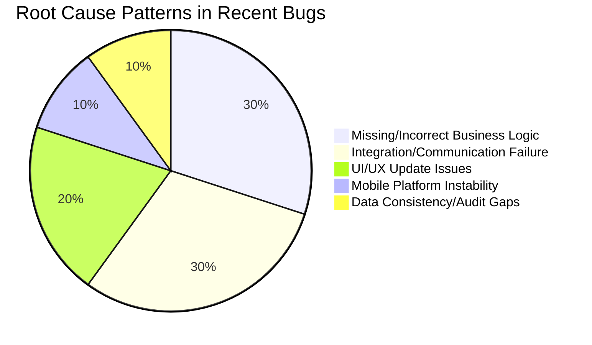
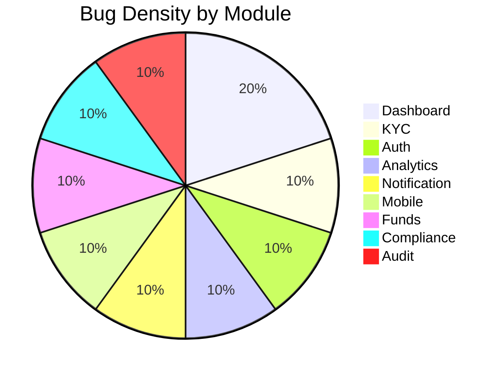
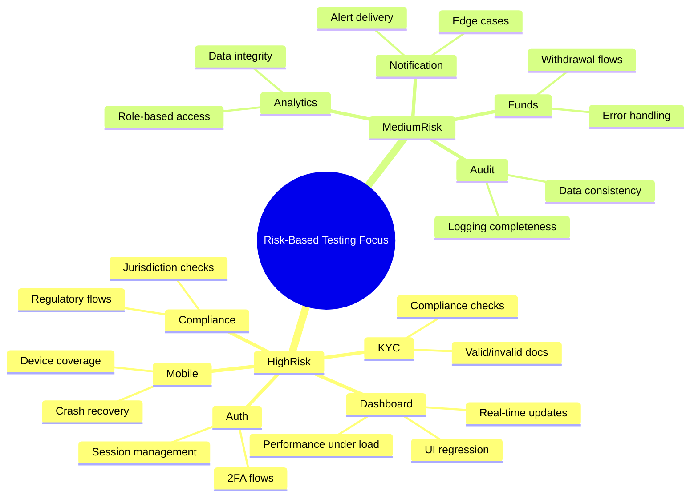

# Risk-Based Testing

This report demonstrates how to use AI prompts for risk-based testing, mapping each prompt to its input (from `bugs_example.csv`) and the resulting actionable outcome. 
Root cause patterns and bug density are visualized using Mermaid JS for compatibility with Git and markdown viewers.

---

## 1. AI-Driven Test Scope Generation from Historical Incidents

**Prompt:**  
“Given these 10 incident reports, list test cases that would have caught the issues earlier.”

**Input:**  
All P1 and P2 bugs from `bugs_example.csv`

**Output:**  
| Title                                               | Steps                                                                                   |
|-----------------------------------------------------|-----------------------------------------------------------------------------------------|
| KYC: Valid/invalid document upload                  | 1. Register user 2. Upload valid/invalid docs 3. Verify KYC result                |
| Dashboard: Real-time update after trade             | 1. Place trade 2. Open dashboard 3. Verify new position appears                   |
| Auth: 2FA prompt for all roles                      | 1. Login as EXCELLENT 2. Enter credentials 3. Verify 2FA prompt                   |
| Analytics: Role-based access for EXCELLENT          | 1. Login as EXCELLENT 2. Open analytics 3. Verify advanced metrics are visible    |
| Notification: Price alert delivery                  | 1. Set price alert 2. Wait for trigger 3. Verify notification is received         |
| Mobile: Order execution on iOS/Android              | 1. Login on device 2. Place order 3. Verify no crash and confirmation shown        |
| Funds: Withdrawal for verified user                 | 1. Login as KYC-verified 2. Request withdrawal 3. Verify success                  |
| Compliance: Block restricted jurisdiction           | 1. Register from restricted country 2. Verify registration is blocked                |
| Audit: Trade execution logging                      | 1. Place trade 2. Check audit logs 3. Verify trade is logged                      |

🎯 **Actionable Steps (Outcome):** Concrete backlog of regression tests to build and automate first.

Example:
A prioritized list of regression test cases derived from the most frequent and severe bugs, such as:
- Automated tests for KYC document upload validation (including negative and edge cases).
- Real-time dashboard update verification after trade execution.
- 2FA authentication flow for all user roles.
- Audit trail logging for every trade and withdrawal.
- Compliance checks for user registration from restricted jurisdictions.

This backlog ensures that the most business-critical and previously problematic flows are covered by automated regression, reducing the risk of recurrence.

---

## 2. Test Prioritization Based on Live Incident Mapping

**Prompt:**  
“Which test cases map to these incidents? Which incidents are not covered by any test?”

**Input:**  
- List of current test cases (assumed, e.g., KYC happy path, dashboard load, login, withdrawal, etc.)
- Incident titles/descriptions from `bugs_example.csv`

**Output:**  
| Incident/Bug Title                                 | Covered by Existing Test? | Gap/Action Needed                  |
|----------------------------------------------------|--------------------------|------------------------------------|
| KYC Verification fails for valid passport          | Partially                | Add negative/edge case tests       |
| Portfolio dashboard does not update after trade    | No                       | Add real-time update test          |
| 2FA prompt missing on login                        | No                       | Add 2FA prompt/auth flow test      |
| Advanced analytics not available for EXCELLENT     | No                       | Add role-based analytics test      |
| Price alert not sent to user                       | No                       | Add alert delivery test            |
| App crashes on order execution                     | Partially                | Expand device/crash coverage       |
| Withdrawal fails for verified user                 | Partially                | Add error handling for withdrawal  |
| User from restricted jurisdiction can register     | No                       | Add jurisdiction compliance test   |
| Trade execution not logged in audit trail          | No                       | Add audit logging test             |

🎯 **Actionable Steps (Outcome):** Risk-based test gap report – immediate input for automation backlog.

Example:
A mapping of current test coverage versus recent incidents, highlighting:
- Missing automated tests for alert delivery, role-based analytics access, and audit logging.
- Partial coverage for mobile trading crash scenarios and withdrawal error handling.
- No coverage for jurisdiction compliance and 2FA prompt flows.

This report directly informs the automation team which high-risk areas lack sufficient test coverage, enabling immediate action to close these gaps.
---

## 3. Generate Risk Scores for Test Candidates

**Prompt:**  
“Here are bugs from module X. Based on recurrence and severity, rate its risk on a 1–5 scale.”

**Input:**  
Bug frequency and severity from `bugs_example.csv` by module.

**Output:**  
| Module/Component         | Bug Count | P1 Count | Risk Score (1–5) | Rationale                                 |
|-------------------------|-----------|----------|------------------|--------------------------------------------|
| Dashboard (UI/Performance) | 2         | 0        | 5                | Frequent, user-facing, business critical   |
| KYC/Onboarding             | 1         | 1        | 5                | Regulatory, onboarding blocker             |
| Authentication/Security    | 1         | 1        | 5                | Security, high business risk               |
| Analytics                  | 1         | 0        | 4                | Role-based, impacts decision making        |
| Notification/Alerts        | 1         | 0        | 4                | Missed opportunities, user trust           |
| Mobile Trading             | 1         | 1        | 5                | Trading loss, app abandonment              |
| Funds/Withdrawal           | 1         | 0        | 4                | Financial risk, user frustration           |
| Compliance/Registration    | 1         | 1        | 5                | Regulatory, legal exposure                 |
| Audit/Trading              | 1         | 0        | 4                | Compliance, traceability                   |

🎯 **Actionable Steps (Outcome):** Focus testing and automation on highest-risk code paths.

Example:
A risk matrix and visualizations (bar chart, mindmap) that show:
- Dashboard, KYC/Onboarding, Authentication/Security, Mobile Trading, and Compliance/Registration modules have the highest risk scores (5/5) due to bug frequency and severity.
- These modules are prioritized for deep exploratory testing, contract tests, and automated regression.
-Lower-risk modules (e.g., Analytics, Notification, Funds, Audit) are scheduled for regular regression but not prioritized for immediate expansion.

This outcome ensures that QA and engineering resources are allocated to the areas most likely to cause business disruption or compliance issues, maximizing the impact of testing efforts.

---

## 4. Root Cause Patterns (Pie Chart Visualization)

- **Missing/Incorrect Business Logic:** e.g., 2FA not triggered, jurisdiction check missing, role-based analytics access
- **Integration/Communication Failure:** e.g., KYC doc recognition, notification delivery, audit logging
- **UI/UX Update Issues:** e.g., dashboard not updating, slow dashboard
- **Mobile Platform Instability:** e.g., app crash on order execution
- **Data Consistency/Audit Gaps:** e.g., audit trail missing, withdrawal logic error

---

## 5. Bug Density by Module (Bar Chart Visualization)

---

## 6. Risk-Based Testing Mindmap (Mermaid)

---

## 7. Summary Table

| Prompt/Use Case                                      | Input Source                | Outcome/Deliverable                        |
|------------------------------------------------------|-----------------------------|--------------------------------------------|
| Test scope generation from incidents                 | P1-P2 bugs (bugs_example.csv)| Regression test backlog                    |
| Test prioritization/gap mapping                      | Test cases + bug titles      | Test gap report                            |
| Risk scoring for modules                             | Bug frequency/severity       | Risk-based test focus                      |
| Root cause pattern detection                         | Bug descriptions             | Pie chart for QA focus                     |
| Bug density visualization                            | Bug count by module          | Bar chart for QA focus                     |
| Risk-based mindmap                                   | Module risk & test ideas     | Mermaid mindmap for QA planning            |

---
