# 🟢 Risk-Based Testing Report (Mermaid JS Visualization)

---

## 1. Bug Density & Risk Mapping

```mermaid
graph TD
    subgraph High Risk [High Risk Modules (Risk Score 5)]
        D1[Dashboard (UI/Performance)]
        K1[KYC/Onboarding]
        A1[Authentication/Security]
        M1[Mobile Trading]
        C1[Compliance/Registration]
    end
    subgraph Medium Risk [Medium Risk Modules (Risk Score 4)]
        AN1[Analytics]
        N1[Notification/Alerts]
        F1[Funds/Withdrawal]
        AU1[Audit/Trading]
    end

    D1 -- "2 bugs" --> D2[UI, Real-time, Performance]
    K1 -- "1 bug" --> K2[Integration, Negative]
    A1 -- "1 bug" --> A2[Security, Auth]
    M1 -- "1 bug" --> M2[Device, Crash]
    C1 -- "1 bug" --> C2[Compliance, Registration]

    AN1 -- "1 bug" --> AN2[Role-based, Data Integrity]
    N1 -- "1 bug" --> N2[Alert Delivery, Edge Cases]
    F1 -- "1 bug" --> F2[Transactional, Error Flows]
    AU1 -- "1 bug" --> AU2[Audit Trail, Data Integrity]
```

---

## 2. Automation Candidates Table (Mermaid Table)

```mermaid
%%| Bug Title | Module/Feature | Test Automation Candidate? | Suggested Test Type |
%%|-----------|----------------|---------------------------|---------------------|
%%| ...       | ...            | ...                       | ...                 |
%% Mermaid does not support markdown tables, so use a flowchart for mapping

flowchart TD
    KYC([KYC Verification fails for valid passport]) -->|API/Integration, E2E| KYC_Tests
    Dashboard([Portfolio dashboard does not update after trade]) -->|UI, Real-time Data| Dashboard_Tests
    Auth([2FA prompt missing on login]) -->|Security, Auth Flow| Auth_Tests
    Analytics([Advanced analytics not available for EXCELLENT]) -->|Role-based Access, UI| Analytics_Tests
    Notification([Price alert not sent to user]) -->|Notification, E2E| Notification_Tests
    Mobile([App crashes on order execution]) -->|Mobile, Stress, E2E| Mobile_Tests
    Funds([Withdrawal fails for verified user]) -->|Funds, Transactional| Funds_Tests
    Perf([Dashboard loads in >5 seconds]) -->|Performance, Load| Perf_Tests
    Compliance([User from restricted jurisdiction can register]) -->|Registration, Compliance| Compliance_Tests
    Audit([Trade execution not logged in audit trail]) -->|Audit, Data Integrity| Audit_Tests
```



---

## 3. Test Scope Generation (Sample)

```mermaid
flowchart TD
    A[Input: P1-P2 Bugs] --> B[Prompt: "List test cases that would have caught the issues earlier"]
    B --> C[Outcome: Regression test backlog]
    C --> D1[KYC: Valid/invalid document upload]
    C --> D2[Dashboard: Real-time update after trade]
    C --> D3[Auth: 2FA prompt for all roles]
    C --> D4[Analytics: Role-based access for EXCELLENT]
    C --> D5[Notification: Price alert delivery]
    C --> D6[Mobile: Order execution on iOS/Android]
    C --> D7[Funds: Withdrawal for verified user]
    C --> D8[Compliance: Block restricted jurisdiction]
    C --> D9[Audit: Trade execution logging]
```

---

## 4. Risk-Based Prioritization Table (Mermaid Gantt)


---

## 5. Summary

- **High-risk modules** (Dashboard, KYC, Auth, Mobile, Compliance) should be prioritized for regression, integration, and negative testing.
- **Automation** should focus on gaps identified in the automation candidates mapping.
- **Test scope** should be expanded based on historical incidents, as visualized above.
- **Risk scoring** and prioritization should guide both manual and automated test planning.

---

*This report uses Mermaid JS to visually map bug trends, automation scope, and risk-based priorities for smarter QA and test planning.*