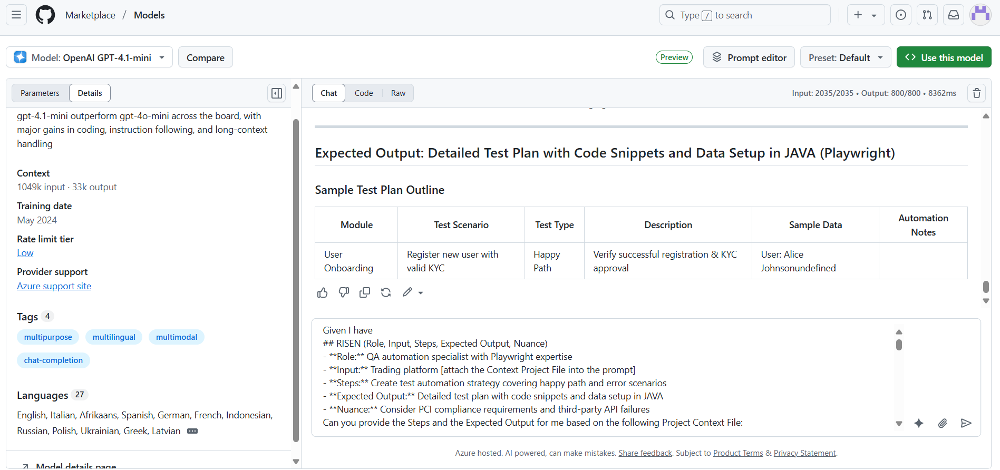

## RISEN (Role, Input, Steps, Expected Output, Nuance)

## Prompt:

- **Role:** QA automation engineer with Playwright expertise
- **Input:** Trading platform [attach the Context Project File into the prompt]
- **Steps:** Create test automation strategy covering happy path and error scenarios
- **Expected Output:** Detailed test plan with code snippets and data setup in JAVA
- **Nuance:** Consider PCI compliance requirements and third-party API failures



## Output:
# Test Automation Strategy Covering Happy Path and Error Scenarios

## 1. Requirement Analysis & Scope Definition

- Study critical user journeys: onboarding & KYC, authentication, trading (order placement), funds management, notifications.
- Enforce PCI compliance aspects around secure handling of payment/fund data (e.g., encryption, no sensitive data logging).
- Identify external dependencies—third-party APIs (e.g., KYC services, payment gateways)—and points of failure.

---

## 2. Test Case Planning

### ✅ Happy Path Scenarios

- Successful user registration with valid KYC docs.
- Login/logout with strong password + 2FA.
- Trading allowed during market open for approved instruments.
- Deposit and withdrawal flows for verified users.
- Real-time notification receipt across channels.

### ❌ Error & Edge Scenarios

- Registration with invalid or missing KYC documents.
- Login failures due to incorrect credentials, disabled accounts, expired sessions.
- Order rejection if market is closed or product not allowed by user’s risk profile.
- Funds management attempts by unverified users.
- Third-party API failures (timeouts, 500 errors) during KYC verification or payment processing.
- Security vulnerabilities: injection attempts, session hijacking, XSS inputs.
- Session timeout and auto-logout enforcement.

### 🔐 PCI Compliance Specific Tests

- Confirm sensitive data (card numbers, auth tokens) never logged or exposed.
- Test encryption of personal/payment data in transit & at rest.
- Validate audit logs capture access/disclosures without sensitive data leakage.
- Enforce user uniqueness by email & government ID checks.

---

## 3. Test Data Design

- Use existing test users:
  - Alice Johnson (LOW expertise)
  - Brian Green (MEDIUM expertise)
  - Clara White (EXCELLENT expertise)
- Generate synthetic users to simulate negative and boundary scenarios (e.g., unverified KYC, expired credentials).
- Create mock/fake data to simulate third-party API responses:
  - Successful and failed KYC/verifications.
  - Payment gateway confirmations and failures.
- Use encrypted test credentials and tokens where applicable to mimic real security constraints.

---

## 4. Test Environment Preparation

- Configure isolated test environments aligned with production (security settings, certificates, DB snapshots).
- Integrate mocks/stubs or service virtualizations for third-party APIs to simulate failure and latency.
- Use **Bamboo** for continuous execution and parallel runs across browsers/devices.

---

## 5. Automation Framework Setup

- **Playwright Java bindings** for UI automation:
  - Page Object Model (POM) to isolate UI selectors.
  - Utilities for secure data access and encrypted handling.
  - Resilient selectors and retry mechanisms to handle fragile UI.
- **API testing via Postman** with JavaScript for edge case coverage.
- **JUnit/TestNG** for orchestration and assertions.
- **Allure reports** for detailed test outcome with PCI compliance audit trails.

---

## 6. Implement Tests Covering:

- UI tests on React.js interface and TradingView widgets.
- Authentication flows with 2FA and session management.
- Trading workflows including market status and risk-profile enforcement.
- Fund movement with KYC verification and audit log checks.
- Notification delivery validation.
- Error scenario simulations including API failures and security breach attempts.

---

## 7. CI/CD Integration and Monitoring

- Automate test triggering on code commits and milestone builds in Bamboo.
- Fail the build on critical security/PCI test failures.
- Analyze flakiness and environment issues from test reports.
- Plan for periodic review and tuning with evolving PCI requirements and API changes.

---

## ✅ Expected Output

- A complete automated test suite validating both happy and edge/error paths.
- Test coverage mapped to regulatory and compliance requirements (PCI, KYC, AML).
- Detailed reports via Allure showing secure test execution.
- Stable and maintainable automation framework integrated into CI/CD workflows.

# Expected Output: Detailed Test Plan with Code Snippets and Data Setup in Java (Playwright)

## 1. Test Plan Outline (Sample)

| Module              | Scenario                                             | Type       | Description                                           | Key Data / Preconditions                        | Notes on PCI & 3rd Party APIs                             |
|---------------------|------------------------------------------------------|------------|-------------------------------------------------------|--------------------------------------------------|-----------------------------------------------------------|
| User Onboarding     | Register with valid KYC docs                         | Happy Path | User completes registration, submits KYC docs, account verified | Synthetic new user with valid docs              | Ensure KYC data encrypted, not logged                    |
| User Onboarding     | Register with invalid/missing KYC documents          | Error      | Registration blocked, error message shown             | Missing or invalid KYC docs                      | Confirm no partial sensitive data stored                 |
| Authentication      | Login + 2FA success                                  | Happy Path | User logs in with password and 2FA                    | Pre-created verified users                        | Enforce password strength, 2FA token validation          |
| Authentication      | Login failure with incorrect password/2FA            | Error      | Login attempt blocked, proper error messages          | Invalid credentials                               | No sensitive info in error, audit log generated          |
| Trading             | Place order during open market, approved product     | Happy Path | Order successfully placed and confirmed               | Market open, user eligible, sufficient funds     | Test order encrypted in transit                         |
| Trading             | Order rejected when market closed or product not approved | Error  | Order placement blocked, error shown                 | Market closed or disallowed product              | Log rejection reasons in audit                          |
| Funds Management    | Deposit funds by verified user                       | Happy Path | Deposit processed successfully                        | Verified user, valid payment method              | PCI compliance: encrypt card data, no logs               |
| Funds Management    | Withdrawal by unverified user                        | Error      | Withdrawal denied, error message shown                | User with pending KYC                            | Audit log entry for denial                              |
| Notifications       | Real-time trade execution notification delivery      | Happy Path | Notification delivered via email, SMS, in-app         | Trade completed                                  | Avoid exposing PII in notifications                     |
| Third-party APIs    | KYC API fails with 500 error                         | Error      | System handles failure gracefully, user notified       | Simulated API 500 via stub                       | Trigger fallback and error workflows                    |
| Third-party APIs    | Payment gateway times out during deposit             | Error      | Deposit retry logic executed, user notified            | Simulated API timeout                            | PCI-safe error handling and logging                     |
| Security (PCI/OWASP)| Attempt XSS injection in input fields                | Security   | Input rejected or sanitized, no script execution       | Malicious script input                           | Confirm protection against XSS                          |
| Session Management  | Session auto-logout after inactivity                 | Security   | User logged out after timeout                         | Active user session                              | Confirm session data cleared, no leakage                |

---

## 2. Sample Data Setup in Java (Playwright Context)

```java
/**
 * Simplified data factory for test users ensuring PCI and security compliance.
 */
public class TestUserFactory {

    public static TestUser createVerifiedUser(String role) {
        return new TestUser.Builder()
            .withUserId("user-" + UUID.randomUUID())
            .withRole(role)
            .withKycStatus("Verified")
            .withTwoFactorEnabled(true)
            .withEmail(generateSecureEmail(role))
            .withPassword(encrypt("StrongP@ssw0rd"))
            .withJurisdiction("UK")
            .build();
    }

    public static TestUser createUnverifiedUser() {
        return new TestUser.Builder()
            .withUserId("user-" + UUID.randomUUID())
            .withRole("LOW")
            .withKycStatus("Pending")
            .withTwoFactorEnabled(false)
            .withEmail(generateSecureEmail("unverified"))
            .withPassword(encrypt("WeakPass123"))
            .withJurisdiction("Unknown")
            .build();
    }

    private static String generateSecureEmail(String role) {
        return "test." + role.toLowerCase() + "@qa.markets.com";
    }

    private static String encrypt(String input) {
        // Placeholder for real encryption logic
        return Base64.getEncoder().encodeToString(input.getBytes());
    }
}

